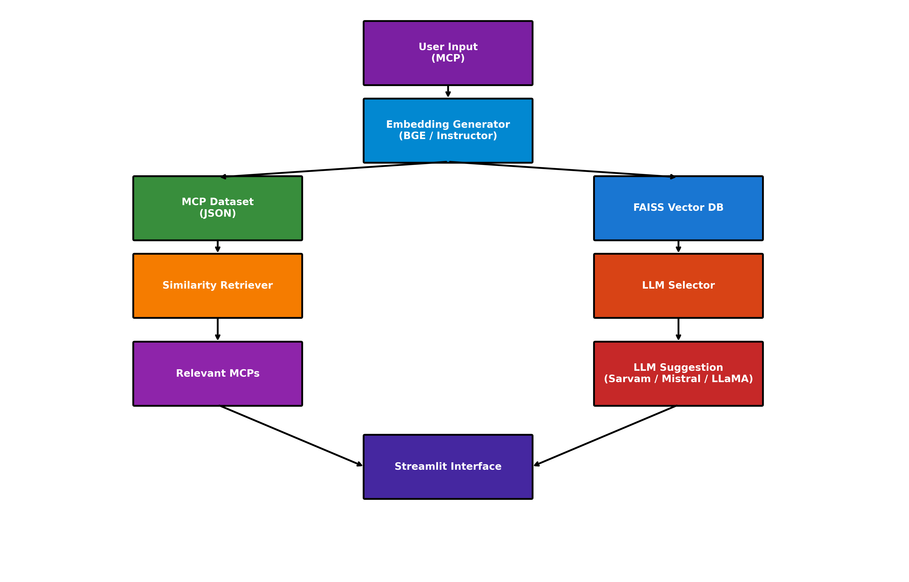

# 🔍 MCP Search Engine

**MCP (Model Context Protocol) Search Engine** is a modern AI research and developer tool designed to explore, query, and build on structured model protocols using state-of-the-art open-source LLMs.

You input a protocol (MCP) describing a model interaction or ML pipeline, and the system:
- Retrieves similar protocols from a curated or custom dataset
- Uses LLMs to suggest compatible tools, models, or APIs
- Provides an interactive GUI (Streamlit) for fast iteration

---

## 📌 Architecture Overview



---

## ✨ Features

- 📁 Upload your own dataset of MCPs (JSON format)
- 🔍 Find similar MCPs using FAISS + BGE embeddings
- 🤖 Get suggestions using open-source LLMs
- 🧠 Choose from Indian 🇮🇳, Korean 🇰🇷, European 🇪🇺, and American 🇺🇸 models
- 🖥️ Intuitive GUI powered by Streamlit

---

## 🧠 Supported LLMs

| Model             | Region     | Description                                               |
|------------------|------------|-----------------------------------------------------------|
| Sarvam-0.5 🇮🇳    | India       | Instruction-tuned model for fast reasoning and QA         |
| Exaone 🇰🇷        | Korea      | LGAI’s EXAONE 1.3B chat model for structured interaction   |
| Mistral-7B 🇪🇺    | Europe     | High-quality multilingual reasoning and instruction model |
| LLaMA-3 🇺🇸       | America    | Versatile general-purpose model with strong performance   |

---

## 💬 Example MCPs

- Extract tabular data from scanned invoices using OCR + LayoutLMv3
- Summarize academic PDFs using mT5 and citation tagging
- Detect toxic content using fine-tuned BERTs for social media
- Product recommendations using user-item embeddings + Faiss
- Chatbot protocol integrating RAG + fallback tools (calendar, weather)

---

## 🚀 How to Run

```bash
pip install -r requirements.txt
streamlit run mcp_search_gui.py
```

> For best performance, run on a machine with GPU and at least 16GB RAM.
